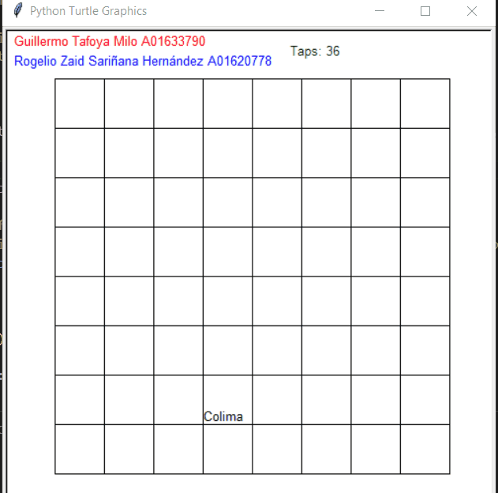
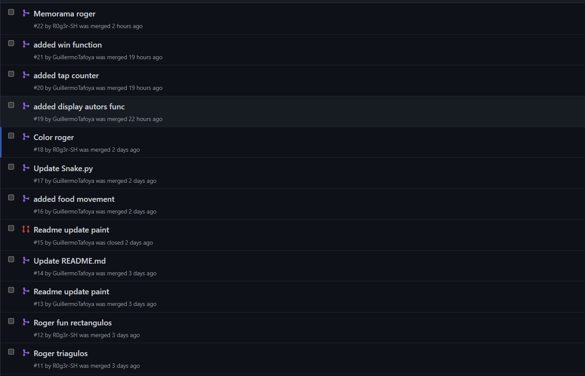

# Memorama

## Preview




## Alumnos
Guillermo A01633790.

Roger A01620778.

## Videos

### [Video Guillermo](https://drive.google.com/file/d/1LYNdZmbqvFPYZfb6wuk0IYSFRNrJgPFm/view?usp=sharing)

### [Video Roger A01620778](https://drive.google.com/drive/folders/17uMP97icxEqS7MdK-MxyZQVeZpztEKxj?usp=sharing)

## Pulls 

## Funciones Guillermo

###  Datos de los alumnos

```python
#Display Autors
def info_alumnos():
    
    x = -240
    y = 230
    writer.up()
    writer.goto(x,y)
    writer.color('red')
    writer.write('Guillermo Tafoya Milo A01633790', align='left', font=('Arial', 10, 'normal'))
    writer.goto(x,y-20)
    writer.color('blue')
    writer.write('Rogelio Zaid Sariñana Hernández A01620778', align='left', font=('Arial', 10, 'normal'))

```
###  Contar Taps
Se utiliza una variable global para mantener la cuenta de cuantos clicks se han dado.
```python
def tap(x, y):
    """Update mark and hidden tiles based on tap."""
    spot = index(x, y)
    mark = state['mark']
    global taps
    taps += 1

    if mark is None or mark == spot or tiles[mark] != tiles[spot]:
        state['mark'] = spot
    else:
        hide[spot] = False
        hide[mark] = False
        state['mark'] = None

writer2 = Turtle()
writer2.hideturtle()
def draw():
    """Draw image, number of taps and tiles."""
    writer2.clear()
    writer2.up()
    writer2.goto(40, 220)
    writer2.color('green')
    writer2.write('Taps: ' + str(taps), align='left', font=('Arial', 10, 'normal'))
```
## Funciones Roger A01620778

### Win
Despliega un mensaje cuando se ha ganado el juego.

```python
def win():
    """Display winning message."""
    if sum(hide) == 0:
        clear()
        writer.clear()
        writer2.clear()
        write('Ganaste un auto!!, Felicidades', align='center', font=('Arial', 20, 'normal'))
```
### Cambiar numeros por estados
El juego utiliza nombres de estados de Mexico como tokens a memorizar.
```python
tiles = ["Aguascalientes"," Baja California", "Baja California Sur", "Campeche"," Coahuila", "Colima"," Chiapas", "Chihuahua"," Durango", "Distrito Federal"," Guanajuato", "Guerrero", "Hidalgo", "Jalisco", "México", "Michoacán", "Morelos", "Nayarit", "Nuevo León"," Oaxaca", "Puebla", "Querétaro", "Quintana Roo", "San Luis Potosí", "Sinaloa", "Sonora", "Tabasco", "Tamaulipas", "Tlaxcala", "Veracruz"," Yucatán","Zacatecas"]*2
```

