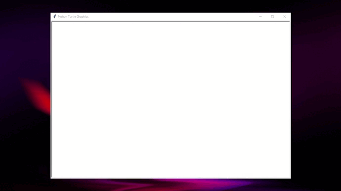

# Paint Game

## Preview



## Instructions
```python
### THE COMMANDS ARE CASE SENSITIVE ###

# Undo
onkey(undo, 'u')

# Change Color
onkey(lambda: color('black'), 'K')
onkey(lambda: color('white'), 'W')
onkey(lambda: color('green'), 'G')
onkey(lambda: color('blue'), 'B')
onkey(lambda: color('red'), 'R')
onkey(lambda: color('yellow'), 'Y')
onkey(lambda: color('purple'), 'P')

# Change Shape
onkey(lambda: store('shape', line), 'l')
onkey(lambda: store('shape', square), 's')
onkey(lambda: store('shape', circle2), 'c')
onkey(lambda: store('shape', rectangle), 'r')
onkey(lambda: store('shape', triangle), 't')
```

## Funciones Guillermo

###  Dibujar Círculo

Esta función toma la posición inicial y final como el diametro. Procede a dibujar un circulo rellenado. <br>
Para obtener la circunferencia solamente, presiona `u` cuando el círculo este terminado.
```python
def circle2(start, end):
    """Draw circle taking the end position as the diameter."""
    if start.y > end.y:
        start.y,end.y = end.y,start.y
    if start.x > end.x:
        start.x,end.x = end.x,start.x
    
    x2 = end.x
    x1 = start.x
    y2 = end.y
    y1 = start.y
    up()
    radius = ((y2-y1)**2+(x2 - x1)**2)**(1/2) / 2
    goto((x2+x1)/2, (y2+y1)/2 - radius)
    down()
    begin_fill()
    circle(radius) # distance between start and end
    end_fill()
```
###  Nuevos Colores
Al presionar las letras mayúsculas `Y` ó `P`, se selecciona el color correspondiente.
```python
onkey(lambda: color('yellow'), 'Y')
onkey(lambda: color('purple'), 'P')
```
## Funciones Roger

### Función 1
```python
print("Hello World!")
```
### Función 2
```python
print("Hello World!")
```


