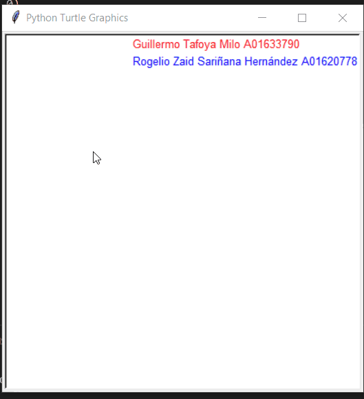

# Paint Game

## Preview




## Alumnos
Guillermo A01633790.
Roger A01620778.

## Instructions
```python
### THE COMMANDS ARE CASE SENSITIVE ###

# Undo
onkey(undo, 'u')

# Change Color
onkey(lambda: color('black'), 'K')
onkey(lambda: color('white'), 'W')
onkey(lambda: color('green'), 'G')
onkey(lambda: color('blue'), 'B')
onkey(lambda: color('red'), 'R')
onkey(lambda: color('yellow'), 'Y')
onkey(lambda: color('purple'), 'P')

# Change Shape
onkey(lambda: store('shape', line), 'l')
onkey(lambda: store('shape', square), 's')
onkey(lambda: store('shape', circle2), 'c')
onkey(lambda: store('shape', rectangle), 'r')
onkey(lambda: store('shape', triangle), 't')
```

## Funciones Guillermo

###  Dibujar Círculo

Esta función toma la posición inicial y final como el diametro. Procede a dibujar un circulo rellenado. <br>
Para obtener la circunferencia solamente, presiona `u` cuando el círculo este terminado.
```python
def circle2(start, end):
    """Draw circle taking the end position as the diameter."""
    if start.y > end.y:
        start.y,end.y = end.y,start.y
    if start.x > end.x:
        start.x,end.x = end.x,start.x
    
    x2 = end.x
    x1 = start.x
    y2 = end.y
    y1 = start.y
    up()
    radius = ((y2-y1)**2+(x2 - x1)**2)**(1/2) / 2
    goto((x2+x1)/2, (y2+y1)/2 - radius)
    down()
    begin_fill()
    circle(radius) # distance between start and end
    end_fill()
```
###  Nuevos Colores
Al presionar las letras mayúsculas `Y` ó `P`, se selecciona el color correspondiente.
```python
onkey(lambda: color('yellow'), 'Y')
onkey(lambda: color('purple'), 'P')
```
## Funciones Roger A01620778

### Dibujar Rectángulo
Toma una posición inicial y final, dibuja un rectángulo con un lado dos veces mayor al otro.

```python
def rectangle(start, end):
    """Draw square from start to end."""
    up()
    goto(start.x, start.y)
    down()
    begin_fill()

    for count in range(2):
        forward((end.x - start.x)*2)
        left(90)
        forward(end.x - start.x)
        left(90)
    end_fill()
```
### Dibujar Triángulo
Toma la función de círculo y lo dibuja con solo tres lados. Es decir, dibuja un triángulo.
```python
def triangle(start, end):
    """Draw triangle from start to end."""
    up()
    goto(start.x, start.y)
    begin_fill()
    down()
    circle(end.x, steps=3)
```


